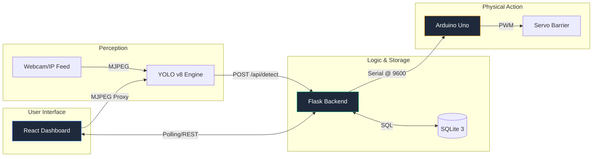

# 🏗️ Project Architecture: Parking Vision Pro
**Automated ALPR & Barrier Control System**

---

## 🗺️ System Map & Topology
The system is built on a distributed micro-services architecture where specialized nodes handle perception, logic, and physical action.

---

## 🛠️ Technical Component Mapping

| Layer | Component | Technology | Responsibility |
| :--- | :--- | :--- | :--- |
| **Frontend** | Dashboard | `React + Vite + Framer Motion` | Real-time monitoring, plate management, manual overrides. |
| **API** | Logic Server | `Python + Flask` | Central hub for data processing, auth checks, and Serial routing. |
| **Detection** | ALPR Engine | `OpenCV + YOLO + Ultralytics` | Video capture and license plate recognition. |
| **Database** | Persistence | `SQLite3` | Authorized whitelist and detection history logs. |
| **Controller** | Barrier Hub | `Arduino + C++` | Physical motion control via Servo motor. |
| **Comm** | Protocol | `REST / Serial / MJPEG` | Inter-service communication. |

---

## 🔄 Lifecycle of a Detection (Step-by-Step)

| Step | Action | Node | Data Transferred |
| :--- | :--- | :--- | :--- |
| **1** | Frame Capture | `camera.py` | Raw Image Data |
| **2** | AI Inference | `camera.py` | Plate: `ABC-1234` |
| **3** | Logic Trigger | `server.py` | `POST {plate: 'ABC-1234'}` |
| **4** | Auth Verification | `database.py` | `SELECT EXISTS` in whitelist |
| **5** | **Authorized** | `server.py` | Signal: `'O'` (Open) via Serial |
| **6** | Physical Action | `Arduino` | Move Servo to 90° |
| **7** | Logging | `database.py` | Insert Log into `parking_logs` |
| **8** | Sync | `App.tsx` | Dashboard UI updates (Live Monitor) |
| **9** | Reset | `server.py` | Signal: `'C'` (Close) after 5s |

---

## 📊 Data Schema Visualization

### 1. `authorized_vehicles`
*Map of plates allowed to trigger the barrier.*
- `id` (INT): Unique ID.
- `plate_number` (TEXT): Unique plate string.

### 2. `parking_logs`
*The live record of system activity.*
- `plate_number` (TEXT): Identified plate.
- `status` (TEXT): `authorized` | `denied`.
- `action` (TEXT): `ENTRY` | `OPEN_BARRIER` | `MANUAL`.
- `timestamp` (DATETIME): Current server time.

---

## 🚀 Deployment Strategy
1. **Perception**: Run `camera.py` on the PC connected to the ALPR camera.
2. **Logic**: Run `server.py` to host the API and connect the Arduino.
3. **Presentation**: Serve the Vite build or run `npm run dev` for the management dashboard.
