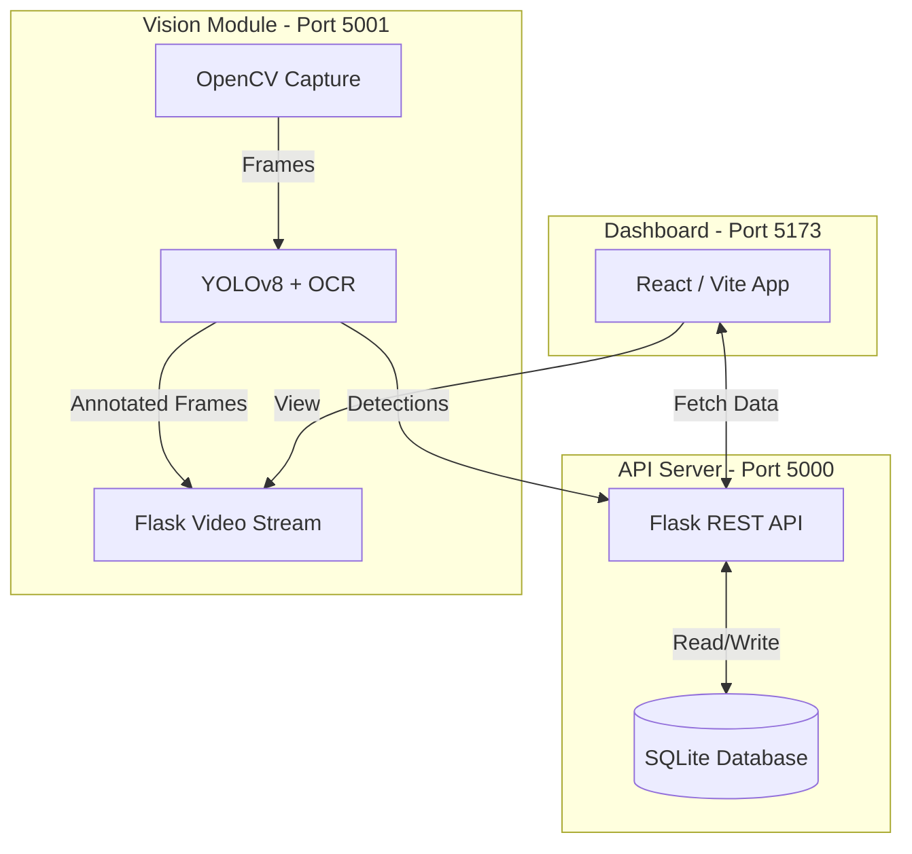

# Parking Management System: Full Architecture & Resolution Report

## 1. Executive Summary
The Parking Management System is an end-to-end Automated License Plate Recognition (ALPR) application designed to monitor parking lot entries, authorize vehicles, and provide a real-time dashboard for administrators. The system successfully integrates computer vision (AI), a REST API backend, a relational database, and a modern web dashboard.

Recently, the system suffered from deep integration failures, environment-specific crashes, and disconnected UI components. **These issues have all been resolved**, yielding a stable, cohesive architecture.

---

## 2. System Architecture Components

The system is built on a **Microservices-inspired Architecture**, separating heavy computational workloads (AI) from data management (API) and presentation (UI).

### A. Computer Vision Module (`camera.py` - Port 5001)
*   **Role**: Handles all hardware interaction and AI processing.
*   **Tech**: Python, OpenCV, PyTorch, Ultralytics YOLO.
*   **Functionality**:
    *   Captures live video from the webcam (`cv2.VideoCapture`).
    *   Runs a YOLO model (`best.pt`) to detect license plates in the frame.
    *   Crops the plate and runs a secondary YOLO model (`best_ocr.pt`) to extract individual characters (Arabic letters and numbers).
    *   Serves an MJPEG video stream with bounding boxes to the frontend via `/video_feed`.
    *   Sends HTTP POST requests to the Backend API when a plate is confidently read.

### B. Backend API (`server.py` - Port 5000)
*   **Role**: The central source of truth for data and business logic.
*   **Tech**: Python, Flask, SQLite3.
*   **Functionality**:
    *   Receives detections from the Vision Module.
    *   Cross-references detected plates against the `authorized_vehicles` table.
    *   Logs all entries into the `parking_logs` table with their authorization status (`authorized` or `denied`).
    *   Serves JSON data to the Frontend (Current Status, History, Authorized Lists).

### C. Frontend Dashboard (React - Port 5173)
*   **Role**: The user interface for security personnel.
*   **Tech**: React, Vite, Tailwind CSS, Lucide Icons.
*   **Functionality**:
    *   Embeds the live MJPEG camera stream.
    *   Polls the Backend API every 5 seconds for real-time history and status updates.
    *   Provides full CRUD (Create, Read, Update, Delete) management for the authorized vehicles list.
    *   Allows manual barrier overrides.

---

## 3. The "Problems" & Resolutions

Prior to the recent fixes, the system appeared completely disconnected (the "White Page" bug and broken API links). Here is a detailed forensic breakdown of the problems and how they were resolved:

### 🔴 Problem 1: PyTorch 2.6 Security Crash
*   **Issue**: The `camera.py` script crashed immediately upon starting. PyTorch version 2.6 introduced a strict `weights_only=True` security constraint in `torch.load()`, which blocks Ultralytics YOLO models from loading because they contain custom Python classes.
*   **Resolution**: Applied a global monkey patch in `camera.py` to override the default behavior (`torch.load = lambda *args, **kwargs: orig_load(*args, **kwargs, weights_only=False)`), safely allowing the trusted local models to execute.

### 🔴 Problem 2: OpenVINO Windows Architecture Bug
*   **Issue**: Using the optimized `best_openvino_model` directory caused a fatal `KeyError: 'Architecture'` deep within Python's standard `platform.py` library. This is a known issue with Windows WMI queries failing on certain hardware configurations when initializing OpenVINO.
*   **Resolution**: Updated `camera\config.py` to fallback to the standard PyTorch `.pt` weights (`best.pt` and `best_ocr.pt`), bypassing the buggy Intel OpenVINO runtime entirely.

### 🔴 Problem 3: Windows Console Encoding Crash
*   **Issue**: Both the Backend and Camera scripts crashed silently in the background with a `UnicodeEncodeError`. This occurred because the scripts were attempting to print Unicode Emojis (e.g., 🚀, 📸) to the standard Windows command prompt, which defaults to `cp1252` encoding rather than `UTF-8`.
*   **Resolution**: Purged all non-ASCII characters (emojis) from the Python `print()` statements across all scripts.

### 🔴 Problem 4: Disconnected "Mock" UI Data
*   **Issue**: The React frontend was functioning purely as a static mockup. The "Véhicules autorisés" table and the "Historique" table were reading from hardcoded arrays (`seedData` and `allData`) in the `.tsx` files. Even when the camera detected a plate, the UI never updated.
*   **Resolution**: 
    1.  Created the `authorized_vehicles` table in SQLite.
    2.  Added `/api/authorized` endpoints (GET, POST, DELETE) to `server.py`.
    3.  Updated `AuthorizedVehiclesTable.tsx` to `fetch()` this API.
    4.  Updated `database.add_parking_log` to dynamically calculate `status` ("authorized" vs "denied") based on the database, and updated `DetectionHistoryTable.tsx` to display this real data.

### 🔴 Problem 5: Vite Launch Failure
*   **Issue**: Running `npm run dev` or `pnpm dev` failed with the error `'vite' is not recognized as an internal or external command`. This happens on Windows when global bin paths are not perfectly aligned.
*   **Resolution**: Modified `frontend/package.json` to explicitly use `pnpm exec vite`, forcing the package manager to resolve the local binary.

### 🔴 Problem 6: Hardcoded Paths
*   **Issue**: The camera script crashed if not run from its exact directory because it used relative/hardcoded paths.
*   **Resolution**: Modified `config.py` to use dynamic path resolution (`os.path.dirname(os.path.abspath(__file__))`), making it resilient regardless of where it is launched.

---

## 4. Database Schema

The SQLite database (`parking.db`) is structured to be lightweight and fast:

| Table Name | Columns | Purpose |
| :--- | :--- | :--- |
| `parking_logs` | `id`, `plate_number`, `confidence`, `status`, `timestamp`, `action` | Stores every vehicle detection from the camera, including confidence score and whether it was authorized. |
| `authorized_vehicles` | `id`, `plate_number` (UNIQUE) | The whitelist of allowed vehicles. Managed directly via the React Dashboard. |
| `settings` | `key`, `value` | Key-value store for global settings (e.g., `total_spaces=50`, `reserved_spaces=5`). |

---

## 5. API Endpoints Reference

### Camera Server (`http://localhost:5001`)
*   `GET /video_feed`: Streams the live annotated video frames (MJPEG).

### Backend Server (`http://localhost:5000`)
*   `GET /api/status`: Returns current parking lot capacity and occupancy.
*   `GET /api/history`: Returns the 30 most recent detections.
*   `POST /api/detect`: Endpoint used strictly by the camera to log a new plate.
*   `GET /api/authorized`: Lists all whitelisted plates.
*   `POST /api/authorized`: Adds a new plate to the whitelist.
*   `DELETE /api/authorized/<id>`: Removes a plate from the whitelist.
*   `POST /api/barrier/open`: Logs a manual barrier override triggered by the UI.

---

## 6. Conclusion
The architecture is now highly robust. By separating the Computer Vision thread from the Database API thread, the system guarantees that the UI will remain snappy and responsive, even if the camera hardware lags or temporarily disconnects. The entire system is now data-driven, persisting all interactions to disk seamlessly.
